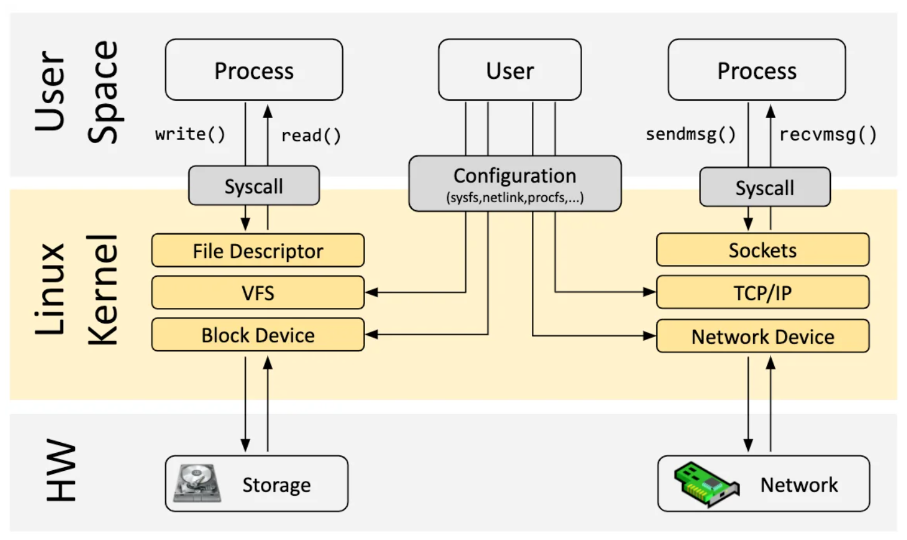

### Table of Contents
- [kernel](#kernel)
  - [tasks performed by the kernel](#tasks-performed-by-the-kernel)
  - [kernel mode and user mode](#kernel-mode-and-user-mode)
  - [process versus kernel views of the system](#process-versus-kernel-views-of-the-system)
- shell
- users and groups
- directory hierarchy(directories,links and files)
- file I/O
- program
- processes
- memory mapping
- static and shared libraries
- interprocess communication and synchronization
- signals
- threads
- process groups and shell job control
- sessions, controlling terminals, and controlling processes
- pseudoterminals
- date and time
- client-server architecture
- realtime
- /proc

# Fundamental Concepts

### kernel
&ensp;&ensp;&ensp;&ensp;အဓိက core operating system က kernel ပါ။ kernel ထဲမှာ command-line interpreters, graphical user interfaces, file utilities, text editiors လိုမျိုး **standard software tool** တွေပါဝင်တယ်။
#### tasks performed by the kernel
- [process](../process/process.md) scheduling
  - linux က preemptive multitasking os ဖြစ်
  - process တွေက memory ပြိုင်တူသုံးခွင့်ရှိ
  - cpu ကိုလဲအလှည့်ကျသုံးခွင့်ရှိအောင်စီမန်တယ်။
  - preemptive ဆိုတာ process တစ်ခုက CPU တစ်လုံးကို ဘယ်လောက်ကြာကြာသုံးခွင့်ပြုမလဲဆိုတာပါ။
- [memory](../memory/memory.md) management
  - process တွေကတစ်ခုနဲ့တစ်ခုခွဲခြားထားတယ်။
  - process ရဲ့တစ်စိတ်တစ်ပိုင်းကပဲ memory ထဲမှာသိမ်းထားတယ်။ virtual memory အနေနဲ့ပေးထားပြီး တကယ်သုံးထားတာပဲ physical memory နဲ့ map ထားတာ။
- [files](../file/file.md) operation
  - file system ပေါ်မှာ create, read, write, update, delete operation တွေကိုလုပ်ဆောင်တယ်။
- creation and termination of [processes](../process/process.md)
  - program တစ်ခုကို ram ထဲကူးထည့်ပြီး resource(cpu,ram,disk)တွေကိုထောက်ပံ့ပြီးrunရင်း process ဖြစ်လာတယ်။
  - process တွေကို အလုပ်လုပ်တာပြီးသွားရင် သုံးခဲ့တဲ့resourceတွေကို ရှင်းလင်းတယ်။
- access to devices
  - program တွေအတွက် computer ကိုချိတ်ထားတဲ့ mouse,keyboard,sensor တွေအတွက် simplified standardize api တွေထောက်ပံ့တယ်။
- networking
  - network packets တွေကို target system ဆီ receive၊ send၊ routeလုပ်တယ်။
- api for system call.
  - kernel entry system call တွေကိုခေါ်ပြီး အမျိုးမျိုးသောအလုပ်တွေလုပ်ဆောင်ခိုင်းတယ်။
#### kernel mode and user mode
- hardware instruction တွေက mode တစ်ခုကနေတစ်ခုကို ချိန်းခွင့်ပြုတယ်။
- virtual memmory တွေကို user space, kernel space ဆိုပြီးခွဲခြားနိုင်တယ်။
- အချို့operationတွေက kernel mode မှာပဲလုပ်လို့ရတယ်။
- kernel mode (supervisor mode)
  - user space memory ကိုပဲသုံးလို့ရတယ်။
  - kernel ထဲမှာရှိတဲ့ instruction, data structure ကိုသုံးမိရင် hardware exception ဖြစ်နိုင်တယ်။
- user mode
  - user and kernel memory နှစ်ခုလုံးသုံးလို့ရတယ်။
#### process versus kernel views of the system